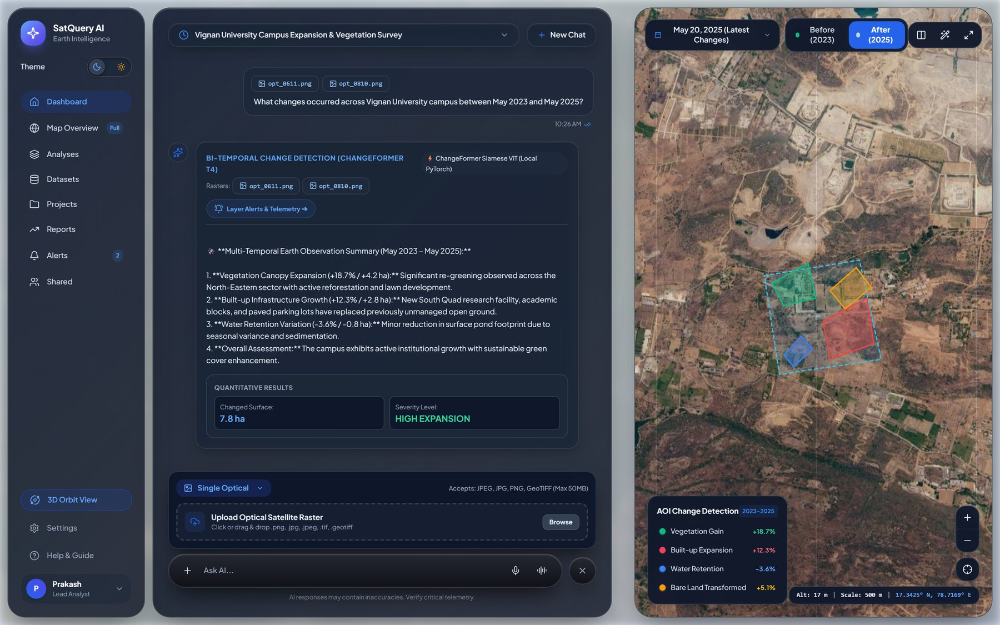

# SatQuery AI — Earth Observation Interface

SatQuery AI is a geospatial intelligence product built around a practical question: **can someone ask about satellite imagery in natural language and get an answer grounded in the imagery rather than having to manually inspect every scene?**

This repository contains the frontend experience and the local vision-language service used while developing the system for Smart India Hackathon 2026.



## What the product is trying to do

Satellite imagery is powerful, but working with it normally involves choosing scenes, opening raster data, comparing dates, inspecting bands, and interpreting changes. SatQuery brings those steps behind a simpler interface.

The current system is built around three capabilities:

- **Natural-language interaction** with the imagery workflow
- **Bi-temporal comparison** for finding and explaining changes between images
- **Vision-language analysis** for image questions, captions, and evidence-based interpretation

## System shape

```text
User query
   ↓
SatQuery interface
   ↓
Analysis request
   ↓
Local GeoChat service
   ├── Single-image VQA / captioning
   ├── Bi-temporal comparison
   └── Visual change overlay
   ↓
Evidence returned to the interface
```

The local service is intentionally separated from the frontend so the vision-language model can be developed and tested independently of the UI.

## Repository structure

```text
llm/
├── frontend/                       # 3D landing experience
├── satquery-frontend-dashboard/    # Earth-observation dashboard
└── geochat_api.py                  # Local GeoChat-7B API
```

## Local vision-language service

`geochat_api.py` is a FastAPI service that loads GeoChat-7B on a local GPU and exposes:

- `POST /chat` — single-image visual question answering / captioning
- `POST /compare` — comparison of two images with visual and semantic analysis
- `POST /compare/visual` — generated visual overlay of changed regions

The service is intended for local development and experimentation; it requires a compatible GPU environment and the model setup described in the code/configuration.

## Repository size

This repository is around 35 MB, almost entirely the PlayCanvas 3D engine and
its assets: glTF models, basis textures, background video, and the engine
bundle itself. The landing experience cannot render without them.

To work on the dashboard or the API alone, clone without the landing assets:

```bash
git clone --filter=blob:none --sparse https://github.com/trushendarreddy-cell/SatQuery-AI-fronend-v4.git
```

## Run locally

Both `serve.py` scripts use only the Python standard library, so the two
static surfaces run with no install step.

Start the landing experience:

```bash
cd llm/frontend
python serve.py 3000
```

Start the dashboard:

```bash
cd llm/satquery-frontend-dashboard
python serve.py 3001
```

Start the local vision-language service:

```bash
pip install -r llm/requirements.txt
python llm/geochat_api.py
```

Set `GEOCHAT_API_KEY` before starting the API if your local configuration requires it.

The vision-language service is the only part with dependencies. It needs a
CUDA-capable GPU, and the `geochat` package itself is not vendored here — it
comes from [MBZUAI's Oryx lab](https://github.com/mbzuai-oryx/GeoChat).

## CI

GitHub Actions compiles all three Python entry points and boots the dashboard
server to confirm it responds. `geochat_api.py` is compiled rather than
imported, because loading the model needs a GPU that a runner does not have.

## Engineering focus

The interesting part of this project is not the landing page. It is the boundary between a natural-language request, geospatial imagery, multimodal reasoning, and evidence shown back to a user.

The frontend is therefore treated as the product surface while the local model service acts as an independent intelligence layer that can be replaced or extended as the analysis pipeline matures.

## Credits

This project is the work of three people:

- **T. Rushendar Reddy** ([@trushendarreddy-cell](https://github.com/trushendarreddy-cell)) — AI/ML architecture, backend, analysis orchestration, the GeoChat service, and this frontend
- **Prakash MB** ([@PrakashMB-1213](https://github.com/PrakashMB-1213)) — dashboard work
- **Shankar** ([@shankar791](https://github.com/shankar791)) — dashboard work

The 3D landing experience was inspired by [EDOLUS](https://edolus.com/). The
local vision-language component uses the open-source
[GeoChat](https://github.com/mbzuai-oryx/GeoChat) model from MBZUAI's Oryx lab.

## Project status

This is an active research/product prototype rather than a finished satellite-analysis platform. The local GeoChat service is functional, while deeper integration between the analysis pipeline and the full dashboard is still being developed.

## Author

**T. Rushendar Reddy**  
Artificial Intelligence and Machine Learning  
Hyderabad, India

## License

MIT — see [LICENSE](LICENSE).
